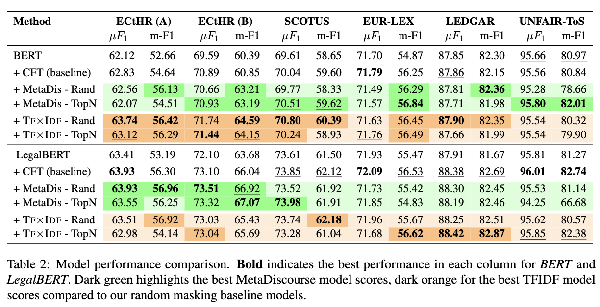

# Language Model Adaptation to Specialized Domains through Selective Masking based on Genre and Topical Characteristics 


Recent advances in pre-trained language modeling have facilitated significant progress across various natural language processing (NLP) tasks. Word masking during model training constitutes a pivotal component of language modeling in architectures like BERT. However, the prevalent method of word masking relies on random selection, potentially disregarding domain-specific linguistic attributes. In this article, we introduce an innovative masking approach leveraging genre and topicality information to tailor language models to specialized domains. Our method incorporates a ranking process that prioritizes words based on their significance, subsequently guiding the masking procedure. Experiments conducted using continual pre-training within the legal domain have underscored the efficacy of our approach on the LegalGLUE benchmark in the English language.


**TL;DR** : Instead of randomly masking words for the MLM (masked language modeling) objective in BERT-like models, we mask "important" words for the domain (terms), document (keywords) or genre (meta-discourse).


## Training Corpus

Our aim was to cover all legal systems appearing in the LexGLUE benchmark as well as [LegalEval](https://sites.google.com/view/legaleval/home) and limit the total size of the corpus.
We chose to limit our dataset to 4GB (similar to [DrBERT](https://aclanthology.org/2023.acl-long.896/)).

We use :
- a subset of [lexlms/lex_files](https://huggingface.co/datasets/lexlms/lex_files), a diverse English multinational legal corpus. It features $\approx$ 19 billion tokens across 11 distinct sub-corpora. It covers legislation and case law from six major English-speaking legal systems:
    - the European Union (EU),
    - the Council of Europe (CoE),
    - Canada, the United States (US),
    - the United Kingdom (UK)
    - and India.
- the [SCOPUS Opinion](https://www.kaggle.com/datasets/gqfiddler/scotus-opinions) corpus.

We selected the following (sub-)corpora, according to their legal systems:

* European Union: EU Court Decisions ([lex_files](https://huggingface.co/datasets/lexlms/lex_files/blob/main/) : `eurlex.zip`)
* Council of Europe: ECtHR Decisions ([lex_files](https://huggingface.co/datasets/lexlms/lex_files/blob/main/) : `ecthr_cases.zip`)
* India: Indian Court Decisions ([lex_files](https://huggingface.co/datasets/lexlms/lex_files/blob/main/) : `indian_courts_cases.zip`)
* United States: SCOTUS Opinion ([gqfiddler/scotus-opinions](https://www.kaggle.com/datasets/gqfiddler/scotus-opinions))


## Continuous-pretraining

1. Download models (and their tokenizers)
```bash
cd continuous-pretraining
python3 "download_models.py"
```
2. Recreate dataset or use your own (a directory with `{train,test,validation}.jsonl`)
```bash
# You will have to download scotus from kaggle:
#  https://www.kaggle.com/datasets/gqfiddler/scotus-opinions
python3 "download_data.py"
```
3. Preprocess the corpus (for each scoring (tfidf, metadiscourse) and model)
```bash
python3 "preprocessing_dataset.py" \
    --data-path "corpus" \
    --model-checkpoint "models/bert-base-uncased" \
    --mask-strategy tfidf --chunk-size 512 \
    --cache-dir "cache_dir" --num-workers 8
```
4. Run continuous-pretraning
```bash
# Using a script (from `continuous-pretraining`)
python3 "run_training.py" \
    --data-path "cache_dir" \
    --model-checkpoint "models/bert-base-uncased" \
    --mask-strategy tfidf --chunk-size 512 \
    --batch-size 16 --num-epochs 10 \
    --mask-choice weighted_random

# or on JeanZay using slurm (from `continuous-pretraining`)
sbatch slurms/run_training_bert-CFT.sh
```

## Evaluation

We use the [LexGLUE](https://github.com/coastalcph/lex-glue) benchmark, a robust assessment based on seven existing legal NLP datasets. LexGLUE is modeled after the criteria used in SuperGLUE and focuses on European and US legal systems. To extend our evaluation to the Indian legal system, we incorporated the LegalEval tasks, enriching our benchmark's scope.

1. Download `lex-glue` and its data
```bash
cd evaluation
sh runme.sh
```
2. Run evaluation
```bash
# On JeanZay using slurm (from `evaluation/lex-glue`)
cd lex-glue
sbatch ../slurms/run_lexglue_BERT-TFIDF-RW.sh

# or using a script (from `evaluation/lex-glue`)
TASK="eurlex"
MODEL_NAME="../../continuous-pretraining/models/bert-base-uncased-jz2-2-4-e10-b16-c512-tfidf-weighted_random-exall/checkpoint-3340"
MODEL_BASE_NAME="BERT-TFIDF-RW"
CACHE_DIR="./data"
BATCH_SIZE=16
ACCUMULATION_STEPS=1
SEED=1
python experiments/${TASK}.py \
    --model_name_or_path ${MODEL_NAME} \
    --task ${TASK} --do_lower_case 'True' \
    --output_dir logs/${TASK}/${MODEL_BASE_NAME}/seed_${SEED} \
    --cache_dir ${CACHE_DIR} \
    --do_train --do_eval --do_pred \
    --report_to 'none' --overwrite_output_dir \
    --load_best_model_at_end \
    --metric_for_best_model micro-f1 --greater_is_better True \
    --evaluation_strategy epoch --save_strategy epoch \
    --num_train_epochs 20 --save_total_limit 5 \
    --learning_rate 3e-5 \
    --per_device_train_batch_size ${BATCH_SIZE} \
    --per_device_eval_batch_size ${BATCH_SIZE} \
    --seed ${SEED} \
    --fp16 --fp16_full_eval \
    --gradient_accumulation_steps ${ACCUMULATION_STEPS} \
    --eval_accumulation_steps ${ACCUMULATION_STEPS}"
```
3. Display results
```bash
python3 show_results.py --logdir lex-glue/logs
```

## Results

<p align="center">
  
</p>


## Credits

This work was granted access to the HPC resources of IDRIS under the allocation 2023-AD011014882 made by GENCI.

This research was funded, in whole or in part, by l'Agence Nationale de la Recherche (ANR), project NR-22-CE38-0004.

## License

[Specify the licensing details for your project. Choose an appropriate license at choosealicense.com if necessary.]

## Citation

```
@misc{belfathi2024language,
      title={Language Model Adaptation to Specialized Domains through Selective Masking based on Genre and Topical Characteristics}, 
      author={Anas Belfathi and Ygor Gallina and Nicolas Hernandez and Richard Dufour and Laura Monceaux},
      year={2024},
      url={https://arxiv.org/abs/2402.12036},
      eprint={2402.12036},
      archivePrefix={arXiv},
      primaryClass={cs.CL}
}
```
